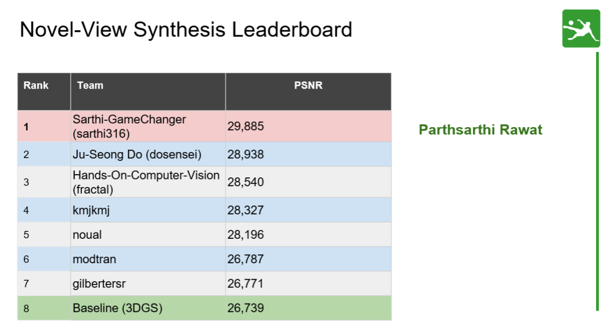

# 🏆 CVAIL – HandsOn Computer Vision for SoccerNet 2026 Novel View Synthesis Challenge

> **The CVAIL - HandsOn Computer Vision approach for SoccerNet 2026 Novel View Synthesis (NVS), based on CUDA-accelerated Rasterization of 3D Gaussian Splatting (3DGS).**

> 🔗 CVAIL Research: https://github.com/cvail-research

> 🔗 Hands-on Computer Vision: https://github.com/cvail-research/Hands-on-Computer-Vision


## 📖 Overview

Our method extends the **gsplat 3D Gaussian Splatting** framework with:

* Depth-guided geometric reconstruction using **Depth Anything V3**
* Improved appearance compensation for challenging viewpoints
* Semantic ensemble of **3DGS** and **Triangle Splatting**
* Color correction through **MVGD statistics transfer**

The pipeline is designed to improve rendering quality under extreme novel viewpoints while maintaining real-time rasterization performance.

---

## 📊 Results

Our method was evaluated on a synthetic validation set consisting of five scenes and compared against the official **gsplat** baseline. While the baseline achieves the best performance on Scene 1, our approach consistently improves rendering quality across the remaining scenes, leading to higher average PSNR and SSIM scores.

| Scene       | gsplat PSNR ↑ | gsplat SSIM ↑ | Ours PSNR ↑ | Ours SSIM ↑ |
| ----------- | ------------- | ------------- | ----------- | ----------- |
| Scene 1     | **30.7053**   | **0.8229**    | 29.8623     | 0.8146      |
| Scene 2     | 28.2402       | 0.8043        | **30.1390** | **0.8414**  |
| Scene 3     | 26.5945       | 0.7814        | **29.1802** | **0.8417**  |
| Scene 4     | 28.5718       | 0.8130        | **28.6485** | **0.8246**  |
| Scene 5     | 28.6487       | 0.7864        | **29.0613** | **0.8010**  |
| **Average** | **28.5521**   | **0.8016**    | **29.3783** | **0.8247**  |

### Summary

* Average PSNR improved from **28.55 dB** to **29.38 dB** (**+0.83 dB**).
* Average SSIM increased from **0.8016** to **0.8247** (**+0.0231**).
* Best performance achieved in **4 out of 5 scenes**.
* Largest gain observed in **Scene 3**, with a **+2.59 dB PSNR** improvement over the baseline.
* Results demonstrate that the proposed depth-guided reconstruction, semantic ensemble, and color correction pipeline provide more accurate and visually consistent novel-view renderings.

---

## 📄 Technical Report

For detailed methodology, experiments, and implementation details:

**Technical Report (PDF):**

[📄 SoccerNet Technical Report](assets/Soccernet_Technical_Report_2026.pdf)

---

## 🔗 Challenge Results & Official Resources

The official SoccerNet Novel View Synthesis Challenge page includes the final leaderboard, winning teams, challenge results, and links to the corresponding CVPR 2026 workshop papers.

**Official SoccerNet Challenge Resources**

https://drive.google.com/drive/folders/1x21bgkszAJueMTezZWc_BmTjqZyg2xor

---

## 🖼️ Qualitative Results

🏆 **Hands-On Computer Vision (CVAIL)** achieved **3rd Place** in the **SoccerNet 2026 Novel View Synthesis Challenge**, obtaining a final **PSNR of 25.540** on the official evaluation benchmark.

<p align="center">
  <a href="assets/SoccernetResults.png">
    
  </a>
</p>

<p align="center">
<b>Official SoccerNet 2026 NVS Leaderboard — CVAIL / Hands-On Computer Vision (3rd Place, PSNR 25.540)</b>
</p>

---

## 👥 Team CVAIL

* Fabian Perez
* Juan Vanegas
* Christian Orduz
* Hoover Rueda-Chacon

Universidad Industrial de Santander (UIS), Colombia


# gsplat

[](https://github.com/nerfstudio-project/gsplat/actions/workflows/core_tests.yml)
[](https://github.com/nerfstudio-project/gsplat/actions/workflows/doc.yml)

[http://www.gsplat.studio/](http://www.gsplat.studio/)

gsplat is an open-source library for CUDA accelerated rasterization of gaussians with python bindings. It is inspired by the SIGGRAPH paper [3D Gaussian Splatting for Real-Time Rendering of Radiance Fields](https://repo-sam.inria.fr/fungraph/3d-gaussian-splatting/), but we’ve made gsplat even faster, more memory efficient, and with a growing list of new features! 

<div align="center">
  <video src="https://github.com/nerfstudio-project/gsplat/assets/10151885/64c2e9ca-a9a6-4c7e-8d6f-47eeacd15159" width="100%" />
</div>

## News

[Jan 2026] [PPIPS](https://research.nvidia.com/labs/sil/projects/ppisp/) is integreated as an alternative way of bilateral grid to compensate the training views.

[May 2025] Arbitrary batching (over multiple scenes and multiple viewpoints) is supported now!! Checkout [here](docs/batch.md) for more details! Kudos to [Junchen Liu](https://junchenliu77.github.io/).

[May 2025] [Jonathan Stephens](https://x.com/jonstephens85) makes a great [tutorial video](https://www.youtube.com/watch?v=ACPTiP98Pf8) for Windows users on how to install gsplat and get start with 3DGUT.

[April 2025] [NVIDIA 3DGUT](https://research.nvidia.com/labs/toronto-ai/3DGUT/) is now integrated in gsplat! Checkout [here](docs/3dgut.md) for more details. [[NVIDIA Tech Blog]](https://developer.nvidia.com/blog/revolutionizing-neural-reconstruction-and-rendering-in-gsplat-with-3dgut/) [[NVIDIA Sweepstakes]](https://www.nvidia.com/en-us/research/3dgut-sweepstakes/)

## Installation

**Dependence**: Please install [Pytorch](https://pytorch.org/get-started/locally/) first.

The easiest way is to install from PyPI. In this way it will build the CUDA code **on the first run** (JIT).

```bash
pip install gsplat
```

Alternatively you can install gsplat from source. In this way it will build the CUDA code during installation.

```bash
pip install git+https://github.com/nerfstudio-project/gsplat.git
```

We also provide [pre-compiled wheels](https://docs.gsplat.studio/whl) for both linux and windows on certain python-torch-CUDA combinations (please check first which versions are supported). Note this way you would have to manually install [gsplat's dependencies](https://github.com/nerfstudio-project/gsplat/blob/6022cf45a19ee307803aaf1f19d407befad2a033/setup.py#L115). For example, to install gsplat for pytorch 2.0 and cuda 11.8 you can run
```
pip install ninja numpy jaxtyping rich
pip install gsplat --index-url https://docs.gsplat.studio/whl/pt20cu118
```

To build gsplat from source on Windows, please check [this instruction](docs/INSTALL_WIN.md).

## Evaluation

This repo comes with a standalone script that reproduces the official Gaussian Splatting with exactly the same performance on PSNR, SSIM, LPIPS, and converged number of Gaussians. Powered by gsplat’s efficient CUDA implementation, the training takes up to **4x less GPU memory** with up to **15% less time** to finish than the official implementation. Full report can be found [here](https://docs.gsplat.studio/main/tests/eval.html).

```bash
cd examples
pip install -r requirements.txt
# download mipnerf_360 benchmark data
python datasets/download_dataset.py
# run batch evaluation
bash benchmarks/basic.sh
```

## Examples

We provide a set of examples to get you started! Below you can find the details about
the examples (requires to install some exta dependencies via `pip install -r examples/requirements.txt`)

- [Train a 3D Gaussian splatting model on a COLMAP capture.](https://docs.gsplat.studio/main/examples/colmap.html)
- [Fit a 2D image with 3D Gaussians.](https://docs.gsplat.studio/main/examples/image.html)
- [Render a large scene in real-time.](https://docs.gsplat.studio/main/examples/large_scale.html)


## Development and Contribution

This repository was born from the curiosity of people on the Nerfstudio team trying to understand a new rendering technique. We welcome contributions of any kind and are open to feedback, bug-reports, and improvements to help expand the capabilities of this software.

This project is developed by the contributors coming from following institutes (unordered):

- UC Berkeley
- NVIDIA
- ShanghaiTech University
- Amazon
- Meta
- IIIT
- LumaAI
- SpectacularAI
- Aalto University
- CMU

We also have a white paper with about the project with benchmarking and mathematical supplement with conventions and derivations, available [here](https://arxiv.org/abs/2409.06765). If you find this library useful in your projects or papers, please consider citing:

```
@article{ye2025gsplat,
  title={gsplat: An open-source library for Gaussian splatting},
  author={Ye, Vickie and Li, Ruilong and Kerr, Justin and Turkulainen, Matias and Yi, Brent and Pan, Zhuoyang and Seiskari, Otto and Ye, Jianbo and Hu, Jeffrey and Tancik, Matthew and Angjoo Kanazawa},
  journal={Journal of Machine Learning Research},
  volume={26},
  number={34},
  pages={1--17},
  year={2025}
}
```

We welcome contributions of any kind and are open to feedback, bug-reports, and improvements to help expand the capabilities of this software. Please check [docs/DEV.md](docs/DEV.md) for more info about development.
